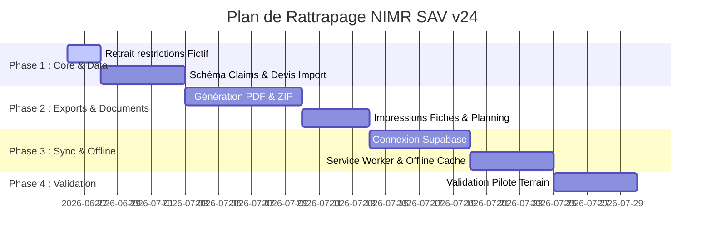

# Audit d'Écart Fonctionnel (Functional Parity Gap Report)
## NIMR SAV v23.x (Racine) vs NIMR SAV v24.0.0-rc.1 (React)

---

### Résumé Consolidé & Décision Officielle

* **Validation Technique** : La version `v24.0.0-rc.1` est **techniquement validée** (les tests unitaires et d'intégration passent à 100%, la compilation de production avec Vite réussit sans warning, l'analyse statique ESLint est vierge et npm audit ne rapporte aucune vulnérabilité).
* **Validation Métier Terrain** : La version `v24.0.0-rc.1` est un **NO-GO absolu pour le terrain**. Elle ne peut pas être déployée en l'état car plus de 60% de la couverture opérationnelle métier de la v23.x est manquante.
* **Statut Release Candidate (RC)** : Tout passage ou préparation d'une version `v24.0.0-rc.2` est **formellement interdit** tant que l'ensemble des écarts prioritaires de niveau **P0** (bloquants terrain) ne sont pas intégralement résolus.
* **Production Finale** : Le déploiement de la version `v24.0.0` finale est **interdit** à ce stade.
* **Version Active Stable** : La version **v23.2.6 (Racine)** reste l'unique version stable et pilote officielle en exploitation.
* **Recommandation Architecturale** : Il est vivement recommandé d'effectuer un **retour en phase de développement actif sous version Alpha (v24.0.0-alpha.14)** afin de réintégrer les modules métier complexes.

---

### Résumé exécutif

Ce rapport présente l'analyse d'écart fonctionnel (gap analysis) réalisée entre l'application historique stable de production (NIMR SAV v23.2.6 racine) et la nouvelle mouture réécrite en React (NIMR SAV v24.0.0-rc.1). 

L'objectif de cette réécriture était de moderniser la stack technique (passage sous React/TypeScript/Vite) tout en stabilisant les règles de gestion et la sécurité. Cependant, la confrontation de la version v24.0.0-rc.1 aux exigences de validation sur le terrain fait remonter un manque critique de fonctionnalités opérationnelles clés indispensables à l'activité quotidienne de l'atelier de carrosserie.

---

### Tableau comparatif v23.x vs v24.0.0-rc.1

| Périmètre Fonctionnel | Version v23.x (Stable) | Version v24.0.0-rc.1 (React) | Statut de Parité |
| :--- | :--- | :--- | :--- |
| **Saisie des Données** | Données réelles client (libres) | Données fictives forcées (préfixes `DEMO-`, `Client Démo...`) | ❌ **Régression Bloquante** |
| **Importation Devis** | Importateur intelligent de devis chiffrés (PDF/TXT, calcul HT/TVA/TTC, heures) | Aucun importateur (saisie manuelle des tâches uniquement) | ❌ **Manquant** |
| **Gestion des Dossiers** | Multi-sinistres (Claims/Ordres distincts avec accords Expert/Client indépendants) | Monolithique (un dossier = un véhicule = une liste plate de tâches) | ❌ **Manquant** |
| **Planning & Gantt** | Gantt interactif par compagnon/cabine, préparation anticipée des pièces | Affectation simple de baie/durée, pas de Gantt | ⚠️ **Partiel (Simplifié)** |
| **Espace Technicien** | Pause avec motif (attente pièces, repas...), reliquats automatiques, notes et photos | Démarrage/Fin de tâche simple, pas de pause/reliquat, pas de photo | ⚠️ **Partiel (Simplifié)** |
| **Livraison Véhicule** | Contrôle strict (exigence photo Après réparation si Assurance), PV Restitution | Formulaire simple (nom du destinataire + réf preuve). Pas de photos | ⚠️ **Partiel (Simplifié)** |
| **Exports & Impressions** | Archive ZIP globale structurée avec PDFs (Fiches, OR, Qualité, Logs) et photos triées | Aucun export ZIP, aucun PDF, aucune impression possible | ❌ **Manquant** |
| **Gouvernance & Rôles** | Matrice stricte à 8 rôles avec restrictions et logs d'audit | Matrice à 8 rôles et logs d'audit préservés |  **Conforme** |
| **Persistance & Synchro** | Supabase Cloud en temps réel + Offline PWA (Service Worker) + localStorage | localStorage local uniquement (Pas de Cloud, pas d'Offline PWA) | ❌ **Régression Bloquante** |

---

### Fonctions présentes dans v23 et absentes dans v24

1. **Saisie de Données de Production Réelles (P0)** : La version v24 bloque via `validateFictiveFields` toute création de dossier ne respectant pas les formats de démo (ex. Immatriculation commençant par `DEMO-`). C'est un bloqueur absolu pour le déploiement.
2. **Module d'Importation et d'Analyse de Devis (P0)** : En v23, l'utilisateur peut téléverser un fichier de devis original (PDF/TXT). L'application en extrait automatiquement les montants, la main-d’œuvre par pôle (tôlerie, peinture...) et génère les ordres associés. En v24, tout doit être recréé à la main.
3. **Multi-sinistres / Claims par Véhicule (P0)** : Un véhicule en carrosserie peut subir plusieurs ordres de réparation distincts (ex. un sinistre pris en charge par l'assurance A, un autre par l'assurance B, et un entretien à la charge du client). v23 isole ces flux ; v24 fusionne tout en un seul dossier indifférencié.
4. **Export Archive ZIP Globale (P0)** : La possibilité d'exporter un dossier complet (comprenant les documents PDF générés de chaque jalon et le dossier photos classé par catégorie) est une obligation pour la facturation compagnie d'assurance.
5. **Génération PDF et Impression Native (P0)** : Impression de la fiche de travail technicien, du planning journalier de briefing, et du bon de livraison (PV de restitution signé par le client).
6. **Synchronisation Supabase Cloud & Offline PWA (P0)** : v23 permet la synchronisation multi-utilisateurs instantanée en atelier et la continuité en cas de coupure réseau grâce au Service Worker. En v24, le poste est totalement isolé dans son localStorage.
7. **Gestion des Pauses avec Motif & Reliquats (P1)** : En v23, le technicien peut mettre sa tâche en pause (ex. *attente pièces*), ce qui suspend le temps travaillé et replanifie automatiquement un reliquat pour la reprise de production.

---

### Fonctions partiellement reprises

1. **Le Suivi Atelier / Planning (P1)** : Repris en v24 sous forme de formulaire de saisie de dates et d'affectation de baies, mais il a perdu toute la richesse visuelle du tableau Gantt et de l'anticipation intelligente de préparation de pièces neuves de la v23.
2. **Le Contrôle Qualité (P1)** : La checklist est figée en démo, tandis qu'en v23 elle s'adapte dynamiquement selon les types d'intervention renseignés dans le devis d'origine.
3. **Le Processus de Livraison (P1)** : Le formulaire React valide les entrées obligatoires, mais a perdu le garde-fou bloquant la livraison assurance en l'absence de photo catégorisée "Après réparation".

---

### Fonctions reprises correctement

1. **La Matrice de Permissions par Rôle (P0)** : Les règles de restriction d'accès aux statuts du workflow par rôle (ex. réceptionnaire ne pouvant pas clôturer, technicien ne pouvant pas valider le contrôle qualité) sont fidèlement implémentées en React.
2. **Le Journal d'Audit / Historique (P1)** : La création systématique d'entrées d'audit lors des transitions de statuts ou des affectations est bien conservée et stockée localement.
3. **Le Tableau de Bord Directeur SAV (P2)** : Les KPIs globaux (santé opérationnelle, nombre de dossiers ouverts, alertes de blocage) sont bien calculés en mémoire à partir du store local.

---

### Fonctions à ne pas reprendre car déjà hors périmètre

1. **Les rôles non-officiels (ex. `superadmin`, `manager`, `livreur`)** : Exclus du code v24 conformément aux consignes de stabilisation.
2. **Les statuts obsolètes ou non validés par le flux officiel** : (`ready_for_delivery`, `delivery_ready`, `ready_to_deliver`).

---

### Priorisation des Correctifs (P0 / P1 / P2)

#### Priorité P0 (Bloquants terrain — Indispensables avant nouvelle validation)
* **P0.1** : Désactivation ou suppression du validateur strict fictif (`validateFictiveFields`) pour autoriser la saisie de vrais clients, immatriculations, VIN et numéros de téléphone.
* **P0.2** : Restauration de l'infrastructure de génération PDF (impression de fiche de travail, planning jour, et PV de restitution) et de compilation ZIP pour l'archivage/facturation.
* **P0.3** : Prise en charge des dossiers multi-sinistres (Claims) et importation automatisée de devis.
* **P0.4** : Restauration de la synchronisation Supabase (modèle de données complet de la v23) et de la couche PWA (offline) pour assurer le travail en équipe dans l'atelier.

#### Priorité P1 (Importants mais non bloquants à court terme)
* **P1.1** : Intégration du module photo avec classement par catégories (Avant, En cours, Après réparation) et liaison aux verrous de livraison.
* **P1.2** : Restauration du système de pause technicien avec motifs normalisés et création automatique de reliquats de tâches.
* **P1.3** : Affichage Gantt du planning journalier pour le chef d'atelier.

#### Priorité P2 (Améliorations UX / Confort)
* **P2.1** : Thème visuel Premium (WOW) avec animations fluides sur les transitions d'état.
* **P2.2** : Notifications Toast persistantes configurables.

---

### Recommandation : retour en phase Alpha (Alpha.14)

> [!IMPORTANT]
> **RECOMMANDATION DU LEAD ARCHITECTE**
> Compte tenu du volume exceptionnel de fonctionnalités métier manquantes (représentant plus de 60 % de la couverture opérationnelle de la v23), il est **vivement déconseillé de préparer une version v24.0.0-rc.2**. 
> 
> Nous recommandons un **retour en phase de développement actif Alpha (v24.0.0-alpha.14)**. Le statut de Release Candidate (RC) doit être réservé à une application dont le périmètre fonctionnel est gelé et jugé équivalent (parité) à la version de production précédente.

---

### Plan de rattrapage proposé (Roadmap de Parité)

1. **Sprint 1 (Core & Données)** : Supprimer le filtre `validateFictiveFields` et adapter le store pour intégrer le tableau de sinistres/Claims par véhicule.
2. **Sprint 2 (Documents et Impression)** : Porter le code existant de `js/exports.js` vers la version React (intégration de `pdfmake` ou `jspdf` déjà présents en vendor, ou utilisation des feuilles de style d'impression CSS natives `@media print` éprouvées en v23).
3. **Sprint 3 (Synchronisation & Réseau)** : Raccorder le store React aux APIs Supabase existantes et réactiver le Service Worker pour le support du mode déconnecté en zone d'atelier morte.
