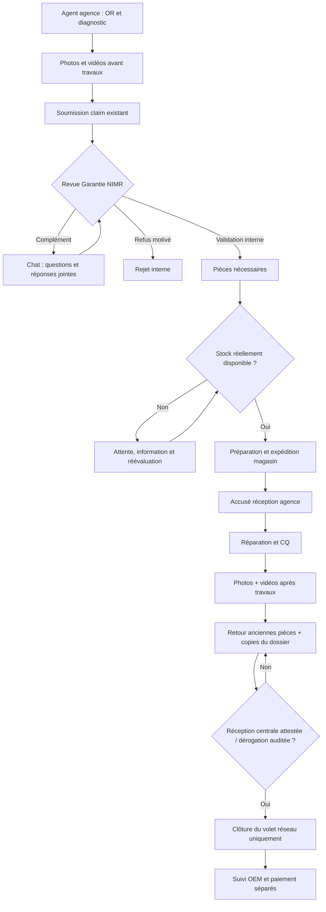

# KHA-76 — WARRANTY-NETWORK-001 : portail Garantie du réseau d'agences

**Date :** 30 septembre 2026. **Base :** `main 64ea0d67578007a59309d462c70b8dba1c3ef337`, après l'architecture KHA-53. **Livraison de ce lot :** contrat de domaine TypeScript isolé + tests métier + architecture/UX. Aucun compte agence, table, connexion temps réel, synchronisation stock, flux Drive PROD ou transition OEM n'est activé par cette PR.

## 1. But métier, vocabulaire et frontière canonique

Un agent de Sousse, Sfax, Djerba, Gabès, Gafsa, Médenine, Bizerte (à mesure de leur habilitation) ou d'une autre agence peut transmettre un diagnostic de garantie au siège NIMR, puis collaborer avec le responsable Garantie NIMR **dans un fil unique attaché au claim canonique**. L'agence réalise et documente la réparation après validation et obtention des pièces. La clôture logistique exige les documents et les pièces anciennes effectivement reçus/validés au siège, sauf dérogation motivée. **Ne pas recréer `repair_claims`, `repair_orders`, `vehicles`, `repair_steps`, le stock ou les médias.**

Le rôle de l'agent **ne lui donne jamais accès à tous les OR du workshop NIMR** : la portée agence est une information d'habilitation serveur, pas un filtre cosmétique de l'interface. Le responsable Garantie peut examiner les agences autorisées et échanger ; le magasinier confirme les stocks et les réceptions physiques. Les rôles sont *capabilities* de ce sous-domaine en attendant un raccordement authentification/RLS testé.

| Rôle métier logique proposé | Provenance et droits | Limites |
|---|---|---|
| `agent_agence` (nouveau) | uniquement claims assignés à son `agency_id` et à son `workshop_id` ; créé/complète dossier, photos/vidéos, chat, accuse réception de pièces, ajoute preuves de réparation, transmet anciennes pièces et copies | ne valide pas sa propre demande ; ne déclare pas réception centrale ; ne modifie pas OEM, paiement ou stock |
| `responsable_garantie_support` (rôle DB déjà mentionné dans le flux VN) | lit les dossiers des agences habilitées ; demande des compléments, valide/refuse **en interne** ; définit pièces requises, contrôle les copies, confirme retour physique si habilité, clôture le volet agence ou motive dérogation | accord interne ≠ accord constructeur, accord client ou paiement |
| `responsable_magasin` (rôle DB existant dans le flux VN) | confirme la disponibilité effective, prépare/réserve via système de stock autorisé, saisit bon/transport, constate physiquement réception des anciennes pièces | ne fait pas la revue technique, ne saisit pas l'accord OEM ni le paiement |
| Directeur SAV / lecture | périmètre de lecture, audit et pilotage à préciser au lot de raccordement | pas de passe-droit automatique sur les décisions constructeur ni sur les réceptions physiques |

**Décision de gouvernance :** la version React alpha.20 gèle volontairement les huit rôles officiels dans ses suites RC ; ne pas changer silencieusement ces tests. Ce lot définit les nouvelles capacités dans `domain/warranty-network.ts` sans intégrer de rôle inactif au LoginScreen ni aux routes tant que l'identité, les memberships et la RLS STAGING ne sont pas vérifiés.

## 2. Flux agent ↔ responsable Garantie ↔ magasin

1. **Brouillon agence.** Sélection du véhicule/OR existant, VIN, kilométrage observé, plainte client *verbatim*, constat de diagnostic, cause suspectée, référence de la pièce causale, DTC éventuels. Les informations maîtres proviennent des entités existantes, et le diagnostic conserve auteur/source/date.
2. **Preuves avant réparation.** L'agent joint photos **et vidéo** du défaut, diagnostic/mesures et codes si disponibles, via MEDIA lié à `photos.claim_id` et à l'OR de l'agence. Pas de photo anonyme ni de fichier encodé dans le claim.
3. **Soumission à Garantie NIMR.** La boîte « Dossiers agences à contrôler » signale l'agence, le dossier, le diagnostic et les preuves. Le responsable peut retourner le dossier pour une ou plusieurs questions *structurées* dans le fil. Chacune porte son identifiant, auteur, date et réponse. L'agent répond dans **le même dossier**, avec fichiers liés. Après résolution de toutes les questions, il revient en revue, sans envoi de nouveau claim.
4. **Décision interne Garantie.** Le responsable valide ou refuse avec motif. Validation interne uniquement, sans forger `repair_claims.status=approved` ni `oem_status=accepted`. Une préautorisation constructeur, si requise, suit KHA-54 et ses propres preuves.
5. **Pièces nécessaires.** La Garantie indique les références, désignations, quantités et éventuelle exigence de retour des pièces défectueuses. Le magasin confirme les quantités **à partir du stock réel** puis réserve/prépare et expédie avec référence de bon/transport ; si indisponible, dossier maintenu en attente, quantité/ETA documentées, pas de fausse expédition. Réutiliser NAVISION/PDR Hub lorsque son API et le flux d'autorisation sont vérifiés.
6. **Réception agence et intervention.** L'agent confirme séparément la réception de chaque ligne expédiée. Réparation seulement lorsque tous les prérequis sont satisfaits ; tracer opérations réalisées, pièces montées, essais et CQ.
7. **Preuves après réparation.** L'agent transmet obligatoirement les photos **et vidéos** après travaux, le CQ/essai et, pour chaque ancienne pièce remplacée, la photo, le conditionnement et la référence de retour.
8. **Retour des anciennes pièces.** L'agence déclare l'expédition avec une preuve et le tracking ; cette déclaration **n'est pas une réception**. Le responsable magasin/garantie atteste la réception physique au siège. Si le constructeur exige conservation en agence ou exonère un retour, le responsable Garantie peut inscrire une dérogation **avec motif et audit**, sans cocher « reçu ».
9. **Copies Garantie.** L'agent conserve la copie du dossier à l'agence (attestation) et transmet le document/fichier à NIMR. Le responsable confirme explicitement la réception et la conformité de la copie.
10. **Clôture du volet agence.** Le responsable Garantie clôture uniquement lorsque preuves post-réparation, CQ, réception des copies et anciennes pièces ou dérogations motivées sont complètes. L'OR atelier peut être déjà restitué ; `oem_status` et `payment_status` continuent indépendamment jusqu'à décision constructeur et rapprochement Finance.

### Vue simplifiée

## 3. Présentation UX — écrans attendus

### Portail « Mes demandes Garantie » — agent agence
- Une seule liste des claims **de son agence uniquement** : N° demande/OR, immatriculation, modèle, VIN masqué selon besoin, date, état, dernière réponse, prochaine action, pièces attendues et retard.
- Bouton « Nouvelle demande Garantie » ouvre un assistant : 1 Véhicule/OR → 2 Diagnostic/DTC → 3 Photos/vidéos initiales → 4 Relecture et soumission.
- Fiche dossier : bandeau identité (agence, OR, véhicule) et statut **du volet réseau**, puis onglets **Diagnostic**, **Preuves**, **Discussion**, **Pièces à recevoir**, **Après réparation**, **Retours & documents**, **Historique**.
- La discussion est un *chat par dossier* (pas conversation globale). Les questions officielles ont un marqueur « Informations attendues » et une action « Répondre et joindre la preuve » ; notifications sur nouveau message ou changement d'état, compteurs non lus à prévoir. Photos/vidéos sont référencées via MEDIA, pas dupliquées dans les messages.
- Après réparation, liste d'obligations avec progression, mais **aucune action permettant à l'agence de cocher la réception du siège**.

### « Garantie Réseau » — responsable Garantie
- Inbox transversale multi-agences avec filtres « Nouveaux », « En attente de l'agence », « À valider », « Pièces », « Après réparation », « Retours/documents », « Clôturables ».
- Vue dossier structurée : résumé véhicule/diagnostic à gauche, preuves et discussion au centre, décisions et checklist sur panneau dédié.
- Bouton « Demander un complément » crée une demande structurée liée à une information ou preuve précise ; « Valider en interne » et « Refuser avec motif » sont des actions distinctes.
- Tableau des références et quantités demandées ; état réel disponibilité/réservation/expédition/réception. Pas d'accès direct non contrôlé pour changer des écritures NAVISION.
- Clôture affiche **les blocages nommés**, par exemple « vidéo après réparation absente », « ancienne pièce non reçue », « copie dossier à vérifier », plutôt qu'un simple pourcentage.

### Magasin
- Liste des demandes approuvées et références/quantités, disponibilité issue de la source stock, bon de préparation, expédition et preuve de transport ; autre file « Anciennes pièces attendues » avec accusé physique de réception, identité, date et référence.
- Les stocks non disponibles restent « en attente » ; une action de l'agence ne peut jamais créer un mouvement de stock ou un accusé physique du siège.

## 4. Design persistance STAGING à reviewer, **NON APPLIQUÉ**

- **Canonique** : ajouter sur `repair_claims` l'identité d'agence/affectation et les éventuels champs diagnostic structurés **après** choix du contrat KHA-53 ; jamais `warranty_cases` comme deuxième claim. Les liens OR↔claim↔agency↔workshop et `deleted_at` doivent être vérifiés de manière serveur et atomique.
- **Habilitation** : table de membres d'agence `(workshop_id, agency_id, user_id, capability, active)` et source d'autorité vérifiée. Ne jamais dériver `agency_id` du JSON envoyé par le navigateur ; une appartenance au workshop ne suffit pas pour lire les claims d'autres agences.
- **Chat** : événements `warranty_claim_messages` et `warranty_information_requests` sous FK claim/workshop/agency ; messages append-only (modération/correction = nouvel événement), auteur/temps issus de session/serveur, éventuels mediaId autorisés via `photos`, pas d'URL Drive ni token en clair. Notification sans diffusion des données sensibles à toute l'entreprise.
- **Pièces** : références liées aux lignes canoniques de MO/pièces (KHA-55), statut de disponibilité et d'expédition spécifique, réservation **transactionnelle** auprès du système stock et identifiants du mouvement/bon. Pas de déduction « disponible » d'un simple booléen envoyé par l'agence.
- **Retours** : une ligne ancienne pièce par pièce réellement remplacée, preuve d'expédition, quantité, accusé de réception **par personne centrale différente**, ou dérogation à motif obligatoire. Copies du dossier : preuve MEDIA et deux attestations distinctes (archivée à l'agence, reçue/vérifiée NIMR).
- **Snapshots/audit** : transitions serveur atomiques avec expected_version, idempotency key et audit immuable. Tables exposées : RLS par `workshop_id` **ET** périmètre agence ; révoquer les INSERT/UPDATE génériques de statuts protégés. Tester les scénarios de traversée inter-agences sous même workshop.
- **Médias** : STAGING `photos` possède `claim_id` et métadonnées MEDIA ; PROD conserve un schéma plus ancien. Corriger sous gate KHA-56/61 la règle `MEDIA_EVIDENCE_FROZEN` pour **ajout limité de nouvelles preuves Garantie après fermeture OR**, sans modifier les preuves initiales ni activer Drive PROD sans son consentement/secret.
- **Séparation d'état** : `repair_claims.status` reste le statut interne canonique et `claim_status` n'est qu'un alias API ; `oem_status` et `payment_status` indépendants. Le `network_status` décrit seulement l'échange/livraison/retour des pièces entre agence et siège, pas l'acceptation du constructeur.

## 5. Gates d'activation et couverture du premier lot

**Déjà présent dans la PR :** module pur `apps/nimr-sav-react/src/domain/warranty-network.ts` avec roles typés, agencement d'état, historique, chat/demandes structurées, preuves référencées, pièces expédiées/réceptionnées, retour physique, copies et blocages de clôture ; tests métier fictifs `tests/warranty-network.test.ts`.

**À faire dans des lots séparés** : corriger 3 lacunes KHA-52 du socle claim ; authentification/assignation des rôles dans PWA/React et DB (ne pas casser les 8 rôles v24 gelés sans recette), migration additive STAGING et RLS/GRANT testés contre clients réels fictifs ; stock NAVISION/magasin ; MEDIA upload réel agence et extension preuves post-clôture ; UI réelle, notifications/chat temps réel ; tests E2E multi-agences, audit conservation, direction et finance ; approbation explicite avant PROD.

**Non-déclaration de disponibilité :** le code de domaine fournit une simulation métier testable. Il ne donne à ce stade ni un nouveau compte agence connecté, ni un chat opérationnel, ni une expédition physique, ni une décision OEM/financière dans les bases. Toute lecture/écriture réellement autorisée devra être imposée côté serveur, pas par ce module TypeScript client.
